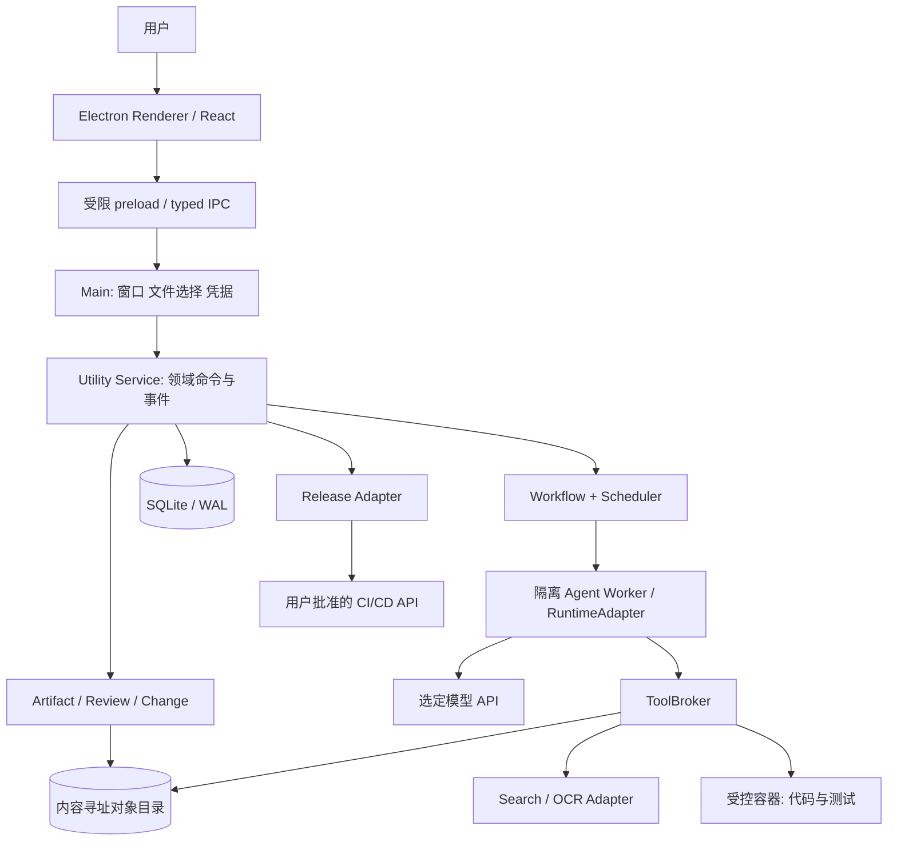
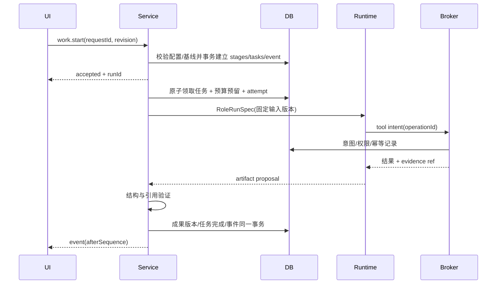

# 系统分析设计

JP-1.0｜架构基线。内部实体与接口以 [数据模型](07-data-model.md)、[接口契约](08-api-contracts.md)为准。

## 1. 部署及组件架构

本机 main 和 service 是可信边界；UI/生成内容不获得 Node、密钥、任意 IPC 或宿主文件访问。Worker 是受控运行代码，但 LLM 输出和下载资料不可信；只能使用 broker 注册工具。首版不监听公共 HTTP 端口，内部传输用 Electron IPC/MessagePort，所有载荷校验。

建议代码目录（待研发创建）：apps/desktop（main/preload/renderer），packages/domain、storage、contracts、workflow、runtime-pi、tool-broker、artifacts、release、ui；tests/contracts、integration、e2e、fixtures。运行时第三方细节只能出现在 runtime-pi 和 adapters，不能渗透 PRD 状态机。

## 2. 模块职责

| 模块 | 输入 → 输出 | 关键限制 |
| --- | --- | --- |
| Domain Service | 受校验命令 → 事务及 domain events | 唯一业务写入口；乐观锁、项目范围和权限核验 |
| Workflow | 工作流模板/基线 → stage/task DAG | 固定模板版本；不让模型任意改阶段结构 |
| Scheduler | 可运行任务/预算 → attempt | 原子领取、租约、并发上限；每任务同一时刻一个有效 attempt |
| RuntimeAdapter | RoleRunSpec → 事件/成果提案 | 模型能力检查、上下文上限、abort；无直接批准权限 |
| ToolBroker | 工具意图 → operation 记录/结果 | 参数校验、最小权限、去重、超时、外部效果核对 |
| Artifact Service | 内容/来源 → immutable version | 两阶段文件引用协议、checksum、草稿冲突处理 |
| Review / Change | 版本集合 → 判断/影响图 | 版本指纹匹配；旧结论失效；受影响任务才阻塞 |
| Verification | 定义/样本/版本 → 结果 | 实测与模拟区分；失败证据、数据/模型/规则追踪 |
| Release | 已批准候选 → 外部 run/生产验证 | 外部幂等键及状态查询，候选变化授权失效 |

## 3. 数据流

源材料不被改写为“事实”；解析结果存模型/解析器版本及位置。来源失败也存失败项。仅被授权的 source span 进入外部模型；证据摘要不能绕过原始材料权限。

## 4. 开始任务与完成时序

提交结果前重查输入 baseline hash、租约 owner 和 task revision；已过期 attempt 的结果可存为历史但不能推进阶段。UI 收到重复事件按 sequence 去重；断线后读取快照及游标。

## 5. 调度与并发

默认每项目 2、全局 3 个模型任务，任务内工具默认串行，只读检索可限流并行。SQLite 事务 BEGIN IMMEDIATE 内检查任务依赖、phase gate、预算并领取租约。租约 30s、每 10s 续约；到期转 reconciling 而非直接重跑。服务使用单实例锁，第二实例聚焦现有窗口，不同时抢同一 DB。

依赖 DAG 无环；工程阶段 architecture/test-design 可并行；代码任务按独立 worktree/container 工作。测试只读指定提交快照，不能修改待测实现。合并由集成任务串行进行，重检接口和测试；冲突进入问题单，不任意覆盖用户文件。

## 6. 持久化与恢复协议

1. 用户命令携 requestId 和 expectedRevision；去重命中返回原结果。状态与事件在同一事务提交。
2. 写文件先落临时对象、fsync、原子 rename 为 sha256 对象，再提交版本引用。DB 失败留下无引用对象；后台只清理超过 24h 且无引用的临时/孤立对象。
3. 工具执行先记录 intent。纯读取可重试；文件写入比较目标哈希；容器命令查容器/日志；发布查外部 run。未知结果进入 uncertain，不能假定没执行。
4. 模型流只把完成的消息/工具结果作为恢复边界；中断的流标为 partial，不当成最终答案。新 attempt 使用已完成消息和版本引用恢复，不重新执行已确认写操作。
5. main/service 崩溃后扫描 running attempts 和 operations，逐一核对；有未知副作用的任务禁止自动重试。只读/模型调用可在确认预算后重试，重复计费风险记录用量未知。
6. 睡眠前尽力暂停调度和保存，不能假设一定收到通知；唤醒走同样核对流程。关闭窗口可保留 app 运行；Cmd+Q 默认暂停并退出，提示当前外部发布是否仍在进行。

## 7. 变更影响算法

有向边 consumer_version → producer_version 记录“依赖/验证/实现/引用”类型。影响分析从被替代版本反向遍历依赖边；普通参考引用可标需检查，implements/verifies/depends-on 强依赖使结果 stale。代码提交、样本集、模型配置、规则均包装为版本化产物引用。

变更的分析阶段只生成 impact 集合。用户接受后一个事务将旧相关 baseline valid=0，标记任务 stale/待重排并创建新 baseline 草案；运行任务在结束提交时再次检查。文档比较和依赖图结论供用户确认，不宣称自动分析能发现所有语义影响。

## 8. 数据及执行规模

首版不做向量库：SQLite FTS 文本检索及文件引用足够用于定义的规模；大内容分块按需读取。索引可重建，不作为原件。列表分页默认 50、最大 200；事件长列表增量获取，输出正文按需加载。

默认单输出文件 50MB，单工具日志 5MB 内联上限（完整日志单独对象，最大 50MB）；超限截断附说明，不截断审批/发布证据。缓存和保留策略见运行文档。

## 9. 组件验证顺序

先 fake runtime 完成状态/恢复/权限契约 → Pi 能力验证 → 文件/技能/文档闭环 → 研发、测试及变更 → pipeline 和安装包。阶段入口与数据契约可以先独立实现；未通过外部依赖实验的能力保持 unavailable。
