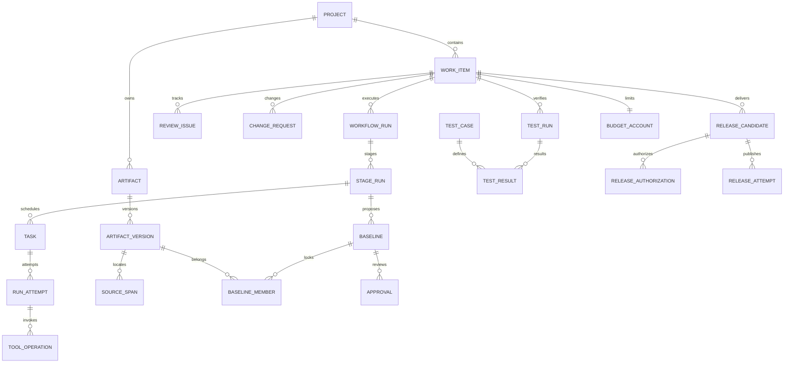

# 数据模型与存储协议

JP-1.0｜[schema.sql](schema.sql)可在 SQLite 中执行，作为首版 migration 的设计输入，不是已经运行的应用数据库。

## 1. ER 图（主关系）

角色模型配置、检查点、权限、技能组、事件、请求去重等完整关系见 SQL。ER 图为主链摘要。

## 2. 类型与关键字段

所有 ID 用 UUID v4，event.seq 为递增 int64；UTC 时间 ISO 8601，展示按用户时区。revision 从 1 开始，每次可变对象更新 +1。JSON 字段经应用 JSON Schema 校验后入库，SQL json_valid 仅保证语法。

| 实体 | 要点 |
| --- | --- |
| project | root_path 是应用管理项目目录的规范路径，不能任意指向系统根；policy_json 包含发送模型、网络、容器、Git 策略 |
| work_item | 三种 kind；mode=checkpoint/explore；goal 为用户原始目标，修订有事件历史 |
| workflow_run | 锁定 template_version 与 config_json；每工作至多一个非终态运行 |
| stage_run | stage_key 与 iteration 唯一；迭代保留旧阶段，不覆盖上一轮验证 |
| artifact/version | artifact 表身份，version 表不可变内容；metadata 保存来源、生成器、引用与编码信息 |
| source_span | locator 是 pdf(page,bbox)、text(lineStart,lineEnd)、docx(paragraph)、image(bbox)、web(url,selector,accessedAt) 之一 |
| baseline | fingerprint=规范排序的成员 ID/hash/purpose、模板版本、相关决定的 sha256；sealed 后成员不得变 |
| approval | 记录用户决定或 Agent 建议；agent 可提出 request_changes/insufficient/assume，不能生成 user approve |
| task/attempt | task 描述目标与输入；attempt 是具体执行，不把重试覆盖第一次记录 |
| tool_operation | 幂等键与请求摘要；重用键但参数不同返回冲突；结果未知不可视作未执行 |
| test_run | target_json 锁定代码 commit、模型配置摘要、数据集/规则/提示版本；is_simulation 必填 |
| release_candidate | manifest、批准基线、target revision 的 fingerprint；任何一项改变重新预检及授权 |
| budget/usage | 预留与结算分开；unknown_usage=1 时暂停新付费调用直到核对/显式接受继续 |

## 3. 产物类型与 JSON 约定

artifact.kind 首版枚举在服务层：source、research、prd、ux、architecture、test_design、briefing、decision_log、skill、skill_group、document、rule、dataset、model_config、prompt、code_snapshot、test_evidence、review_report、release_manifest、operation_log。SQL 留字符串以便添加类型，未知类型必须拒绝普通创建命令，只能经 migration/template 升级新增。

version.metadata：schemaVersion、generator(name/version)、sourceRefs(versionId/spanId)、evidenceKind(user_provided/retrieved/inferred/measured/synthetic)、taskId?、formatOptions?。原始密钥禁止入任何 JSON。

task.spec_json：objective、requiredOutputs[{kind,checks}]、inputVersionIds、skillVersionIds、roleConfigSnapshot、maxTurns、allowedToolNames、workspaceRef?、acceptanceCriteria。配置快照只保存 secret_ref，不复制密钥。

skill_version.manifest_json：name/description/entry、inputSchema/outputSchema、resourceHashes、requiredCapabilities、testCases、formatVersion。技能组依赖及映射存成员 mapping_json：dependsOnKeys、inputBindings、outputSchema；服务校验环、悬空节点和类型兼容。

release_target.contract_json：triggerUrl、statusUrlTemplate、rollbackUrl?、authRef、pollIntervalSeconds、allowedHosts、responseMapping。禁止任意脚本表达式，responseMapping 只支持声明式 JSON path；地址必须匹配批准的 hosts。

## 4. 路径与引用

应用 userData 下：state/jojo.sqlite、objects/sha256前两位/完整hash、tmp、logs、secrets.enc、backups。用户选择的项目目录下：exports、workspace、worktrees；外部导入先复制到受管理对象区。所有导入内容带原始来源信息，原路径只用于显示，不用于执行后续写入。

多个版本可以引用相同内容对象（例如回退正文或更新来源元数据），只对对象存储去重，不禁止新版本使用相同hash。

内容正文不塞入大 JSON；对象哈希验证后提供只读流。导出路径由用户文件选择器返回的能力令牌控制，模型不能直接指定宿主任意路径。

## 5. 一致性责任

数据库保证：FK、状态枚举、唯一 active run、唯一 running attempt、同一 artifact 版本号唯一、版本不能 UPDATE、sealed baseline 成员保护、模型不能以 agent 身份写 approve、pass/fail 测试必须有证据引用。

服务另保证：全部跨实体引用属于同一项目/合法共享库；依赖图无环；同 artifact 的 parent；审批摘要与当前基线一致；阶段必需产物完整；基线 seal 前重新计算摘要；被批准成员不可替换；版本化配置变更使 capability check 失效；敏感 scope 不越权。

这些跨行规则不能仅靠 UI 或 SQL CHECK，必须在事务内实现并以反例测试。approval.actor_kind 由身份上下文决定，忽略客户端试图冒充 user 的字段。renderer 用户命令与 Agent tool 命令使用不同 dispatcher。

## 6. 迁移、备份、删除

迁移开始前检查磁盘空间，暂停调度并用 SQLite online backup 或等价一致快照生成备份（不能运行中只复制 .sqlite 忽略 WAL）。迁移事务失败回滚，旧 app 不打开高版本 schema。

删除分两步：用户确认后标项目 deleted，停止任务、撤销授权；purge 服务按引用逆序删除该项目数据及不再共享的对象。sealed member 删除只在所属项目 deleted 时允许；其他情况下拒绝。被其他项目显式引用的共享技能保留并显示说明。UI 明确删除应用副本，不触碰原始文件；已有用户备份须独立删除，不承诺存储介质法证级擦除。

事件与用量记录默认随项目保留；临时流日志 30 天后可清理，但批准/发布/测试证据引用的对象不得按普通日志策略删除。配置与凭据不随项目 ZIP 导出。

## 7. 来源

持久化实现需遵循 SQLite 官方 [WAL](https://www.sqlite.org/wal.html) 与 [外键](https://www.sqlite.org/foreignkeys.html)说明；上面的模式与约束是本项目设计。
